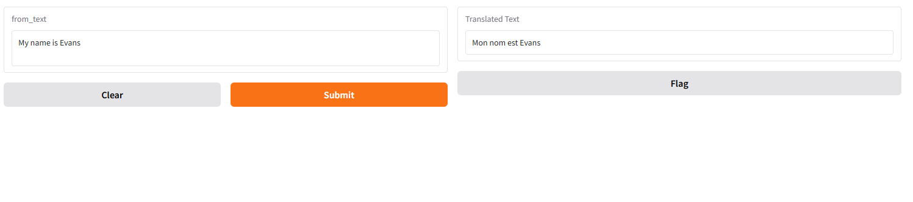

# Simple Language Translation App

This project demonstrates a translation application built using the Hugging Face Transformers library and Gradio for the user interface. The app leverages the power of pre-trained transformer models to translate text from English to French seamlessly.

## Features

- **English to French Translation**: Translate any text from English to French using Hugging Face's T5 model.
- **Interactive User Interface**: A user-friendly Gradio interface for inputting text and viewing translations.
- **Colab Integration**: Fully functional in Google Colab with easy setup and usage.

## Tech Stack

- [Hugging Face Transformers](https://huggingface.co/transformers): For the translation pipeline.
- [Gradio](https://gradio.app): For creating an intuitive web-based interface.
- Python: The core programming language.

## Results

## Customization

- You can extend the translation functionality by modifying the `pipeline` to use other pre-trained models or translate between different languages.
- Update the Gradio interface to include additional features like batch translation or file uploads.

## Known Issues

- The app defaults to using the CPU. If running on Colab with GPU enabled, update the `device` parameter in the `pipeline` to utilize GPU (`device=0`).

## License

This project is licensed under the MIT License. See the [LICENSE](LICENSE) file for details.
